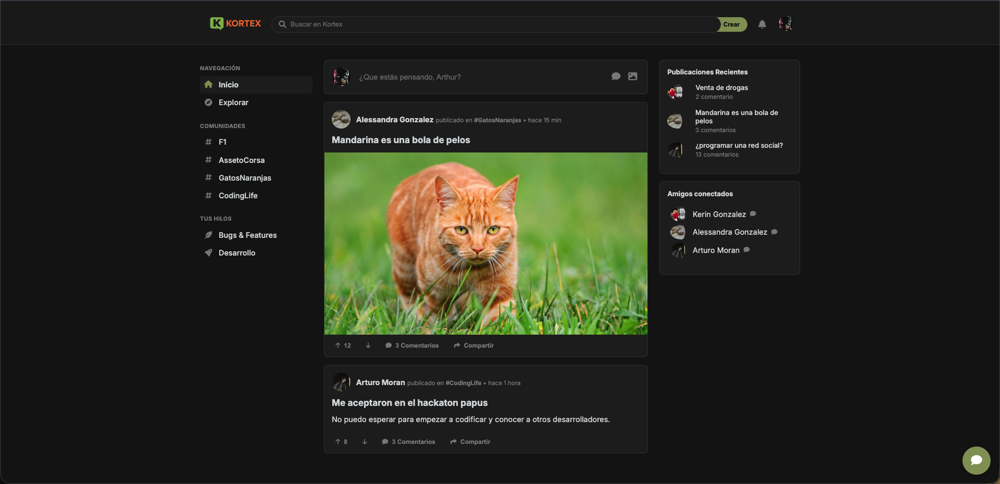

# 🌐 KORTEX

KORTEX es una red social moderna y minimalista construida con **HTML** y **CSS** puro.  
El objetivo del proyecto es recrear la experiencia de una red social tipo foro/comunidad donde los usuarios pueden compartir publicaciones, interactuar con amigos y personalizar sus perfiles.

---

## ✨ Características

- 📰 **Feed principal** con publicaciones (texto e imágenes).  
- 🔍 **Barra de búsqueda** para explorar contenido.  
- 👥 **Comunidades** organizadas por temas.  
- 📩 **Burbuja de chat flotante** sin funcionalidad (solo HTML + CSS).  
- 🧑‍💻 **Páginas de perfil** con avatar, portada y biografía.  
- 🌗 **Soporte para modo claro/oscuro** mediante `prefers-color-scheme` cambio automatico.  
- 📱 **Diseño responsivo** para escritorio, tablets y móviles.  

---

## 🖼️ Vista previa



---

## 📂 Estructura del Proyecto

KORTEX/
│── index.html # Página principal (feed)

│── perfil1.html # Perfil principal

│── perfilArturo.html # Perfil 1

│── perfilAlessandra.html Perfil 2

│── perfilKerin.html Perfil 3

│── css/

│ └── style.css # Estilos principales

│── assets/

│ ├── kortex.png # Logo

│ ├── batman.jpg # Avatares de prueba

│ ├── gatos-naranjas.jpg # Posts de prueba

│ └── ... # Imágenes adicionales

---

## 🚀 Instalación y Uso

1. Clona este repositorio:
   ```bash
   git clone https://github.com/tuusuario/kortex.git

2. Abre el archivo index.html en tu navegador favorito.
3. (Opcional) Usa una extensión como Live Server en VS Code para mejor experiencia.

🛠️ Tecnologías

HTML5
CSS3 (Grid, Flexbox, Media Queries)
Font Awesome (iconos)
Google Fonts (Inter)

📱 Responsividad
Desktop (≥ 1024px) → Layout con sidebar izquierda, feed central y sidebar derecha.
Tablet (768px – 1023px) → Se oculta la sidebar derecha.
Móvil (< 768px) → Solo se muestra el feed, con navegación simplificada.

🔮 Próximos pasos
 Mejorar el sistema de publicaciones (likes, comentarios dinámicos).
 Implementar sistema real de chat (HTML + JS o backend).
 Añadir base de datos para perfiles y posts.
 Conseguir login funcional
 Mejorar responsividad

👨‍💻 Autor
Proyecto creado por Arturo Morán como práctica de diseño web y desarrollo frontend.
Si quieres colaborar, ¡eres bienvenido! 🙌
